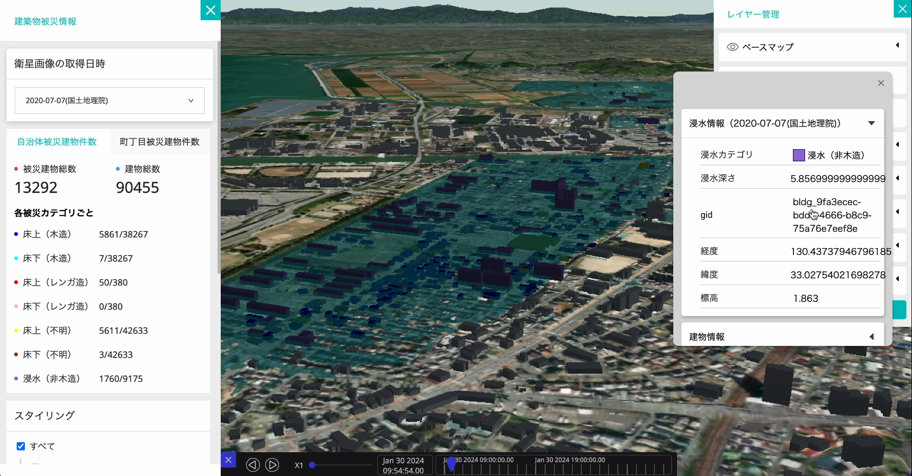

# SAR 衛星解析による洪水被害の推定結果の可視化を行う Re:Earth プラグイン

 <!-- OSSの対象物のスクリーンショット（画面表示がない場合にはイメージ画像）を貼り付けください -->

## 1. 概要 <!-- 本リポジトリでOSS化しているソフトウェア・ライブラリについて1文で説明を記載ください -->

本リポジトリでは、2023年度のProject PLATEAUが開発した「SAR 衛星解析結果の可視化を行う Re:Earth プラグイン」のソースコードを公開しています。「SAR 衛星解析結果の可視化を行う Re:Earth プラグイン」は、SAR衛星データを解析して得られる分析結果を数値および建物の色分けによって可視化する機能とインフォボックスを用いた建物毎の被災カテゴリ別に可視化を行う機能、浸水結果を3D Tilesやヒートマップを用いて可視化する機能から構築されています。

### Re:Earth とは

[Re:Earth](https://reearth.io/)はノーコードで扱える WebGIS（地理情報システム）プラットフォームです。地理空間データの管理、分析、可視化を GUI 操作のみで実行できるように設計されています。Re:Earth は、ブラウザ上で動作するため、インストール不要でアクセス可能です。GeoJSON、Shapefile、CZML、KML など、様々な標準 GIS データフォーマットに対応しており、クリック操作とドラックアンドドロップのみで、データの分析と可視化を行えます。  
Re:Earth はプラグインによる機能拡張が可能となっており、用途に合わせて利用者自らが新機能の開発や既存機能のカスタマイズを行えます。プラグインが格納された zip ファイルを Re:Earth の編集画面（Re:Earth Editor）にてアップロードすることで、プラグイン機能の利用が可能となります。

## 2. 「人工衛星観測データを用いた浸水被害把握等」について <!-- 「」内にユースケース名称を記載ください。本文は以下のサンプルを参考に記載ください。URLはアクセンチュアにて設定しますので、サンプルそのままでOKです。 -->

本システムを構築する3つの機能は、Re:Earthプラグインを用いて実装を行い、Re:Earth Viewer 上に可視化しています。
本システムは「[SAR 衛星解析による洪水被害の推定システム](https://github.com/Project-PLATEAU/SAR-image-based-flood-damage-detector/)」で作成したデータが利用可能。
本システムの詳細については[技術検証レポート](https:XXX)をご参照ください。

## 3. 利用手順 <!-- 下記の通り、GitHub Pagesへリンクを記載ください。URLはアクセンチュアにて設定しますので、サンプルそのままでOKです。 -->

本システムの構築手順及び利用手順については[利用チュートリアル](https://project-plateau.github.io/reearth-plugin-flooddamage-widget/)を参照してください。

## 4. システム概要 <!-- OSS化対象のシステムが有する機能を記載ください。 -->

### 【罹災証明書発行プラグインウィジェットの設定】

#### ① 被災建物リスト（CSV 形式）と 3D 都市モデルの連動

- 罹災証明書発行プラグインの Resource に行政区分図と被災カテゴリごとの色分けと連動させる 3D 都市モデルの 3DTiles のタイトルを入力する。
- 罹災証明書発行プラグインのデータリストに追加したい衛星画像の解析結果のタイトルと建物被災データの入力を行う。
- データリストを追加することで、衛星画像の取得日時を選択できるようになり、建物被災データが入力されることで、3D 都市モデルの属性データと連動する。

### 【レイヤー管理ウィジェットの設定】

#### ② ベースマップの編集

- ベースマップの選択を行えるように、タイルリストを追加し、ベースマップとサムネイル画像とタイトルを設定することで、プラグイン上でベースマップの切り替えが行えるようになる。

#### ③Resource タブ

- 3D 都市モデルの 3DTiles のタイトルを入力することで 3D 都市モデルの表示／非表示の切り替えを行えるようになる。3D ビュー上の 3D 都市モデルをクリックすることで、被災建物情報と 3D 都市モデルに格納されている属性情報を確認できる。
- 行政区分図タイトルを設定することで町丁目データが可視化され表示／非表示の切り替えを行えるようになる。
- e-Stat 非就業者世帯数のデータを設定することで、e-Stat 非就業者世帯数が可視化され表示／非表示の切り替えを行えるようになる。

#### ④ 衛星画像の取得日時の選択と連動したデータの表示／非表示

- 以下のデータ項目について、リストを追加して、該当データの設定を行うことで可視化され表示／非表示の切り替えを行えるようになる。
- リストは衛星画像の取得日時の選択と連動して、データの切り替えが行われるようになる。

| 名称                       | 内容                                                           |
| -------------------------- | -------------------------------------------------------------- |
| 浸水域 2D 表現             | 衛星解析によって得られる浸水域の XYZ タイルデータ              |
| 浸水域 3D 表現（点群）     | 衛星解析によって得られる浸水域の点群の 3D タイルデータ         |
| 浸水域 3D 表現（ポリゴン） | 衛星解析によって得られる浸水域を 3D のポリゴンデータ化したもの |
| 床上(木造)データ           | 衛星解析によって得られる床上浸水（木造）のヒートマップ         |
| 床下(木造)データ           | 衛星解析によって得られる床下浸水（木造）のヒートマップ         |
| 木造家屋総数データ         | 衛星解析によって得られる木造家屋総数のヒートマップ             |

### 【罹災証明書発行プラグインウィジェットの操作】

#### ⑤ 衛星画像の取得日時の選択

- 表示する衛星画像の取得日時を選択することができる。
- 建物被災データや、浸水域 2D 表現をはじめとしたデータの切り替えが行える。

#### ⑥ 被災建物件数の表示

- 被災建物件数と被災カテゴリ別の被災建物件数を表示する。
- 町丁目を選択することで町丁目単位の被災建物件数と被災カテゴリ別の被災建物件数を表示する。

#### ⑦ 建物のスタイリング

- 3D ビュー上の 3D 都市モデルの被災カテゴリ別の色分けの設定を行うことができる。

#### ⑧ データのダウンロード

- 選択した町丁目単位のデータのダウンロードができる。

### 【レイヤー管理ウィジェットの操作】

#### ⑨ データの表示／非表示

- データの表示／非表示が選択できる。

## 5. 利用技術

| 種別       | 名称                                                          | バージョン | 内容                                                      |
| ---------- | ------------------------------------------------------------- | ---------- | --------------------------------------------------------- |
| ライブラリ | [D3](https://d3js.org/)                                       | 7.8.5      | JavaScript ベースのデータ可視化ライブラリ                 |
|            | [shapefile-js](https://github.com/calvinmetcalf/shapefile-js) | 4.0.2      | JavaScript で Shapefile 形式の地理データを扱うライブラリ  |
|            | [Moment.js](https://momentjs.com/)                            | 2.29.4     | JavaScript の日時操作を簡素化し、使いやすくするライブラリ |

## 6. 動作環境 <!-- 動作環境についての仕様を記載ください。 -->

| 項目               | 最小動作環境                                                                                                                         | 推奨動作環境 |
| ------------------ | ------------------------------------------------------------------------------------------------------------------------------------ | ------------ |
| OS                 | Web ブラウザが動作する全てのデスクトップ OS（Windows, macOS, Linux, Chrome OS）やモバイル OS（iOS、Andorid）に対応                   | 同左         |
| 対応ブラウザ       | Chrome 58\_   Firefox 57+   Safari 11+（macOS のみ）   Microsoft Edge XX 以降   iOS(11+) Safari   Android(10+) Chrome | 同左         |
| ディスプレイ解像度 | 1000×700 以上                                                                                                                        | 同左         |
| ネットワーク       | 必要                                                                                                                                 | 同左         |

## 7. 本リポジトリのフォルダ構成 <!-- 本GitHub上のソースファイルの構成を記載ください。 -->

| フォルダ名 | 　詳細                                     |
| ---------- | ------------------------------------------ |
| plugins    | プラグインが格納されているフォルダ         |
| img        | README.md 用の画像が格納されているフォルダ |

## 8. ライセンス <!-- 変更せず、そのまま使うこと。 -->

- ソースコード及び関連ドキュメントの著作権は国土交通省に帰属します。
- 本ドキュメントは[Project PLATEAU のサイトポリシー](https://www.mlit.go.jp/plateau/site-policy/)（CCBY4.0 及び政府標準利用規約 2.0）に従い提供されています。

## 9. 注意事項 <!-- 変更せず、そのまま使うこと。 -->

- 本リポジトリは参考資料として提供しているものです。動作保証は行っていません。
- 本リポジトリについては予告なく変更又は削除をする可能性があります。
- 本リポジトリの利用により生じた損失及び損害等について、国土交通省はいかなる責任も負わないものとします。

## 10. 参考資料 <!-- 技術検証レポートのURLはアクセンチュアにて記載します。 -->

- 技術検証レポート: https:XXX
- PLATEAU Web サイトの Use case ページ「人工衛星観測データを用いた浸水被害把握」: https://www.mlit.go.jp/plateau/use-case/uc23-01/
