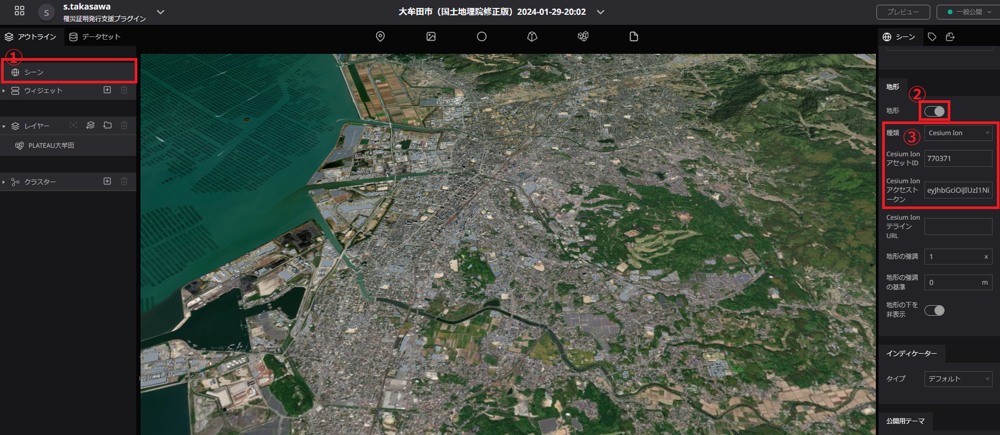
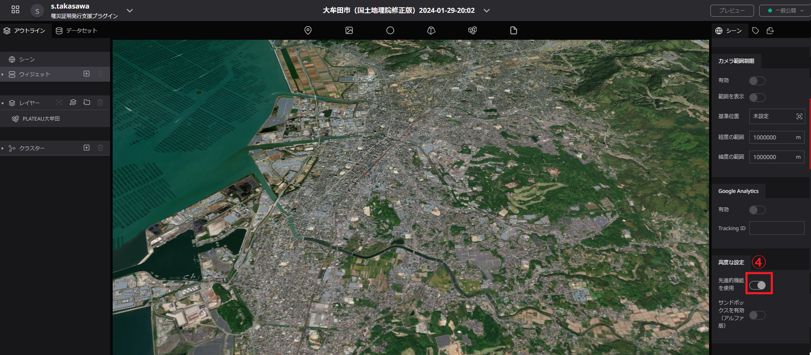
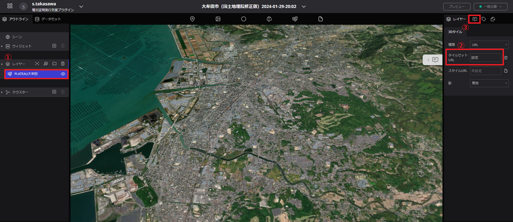
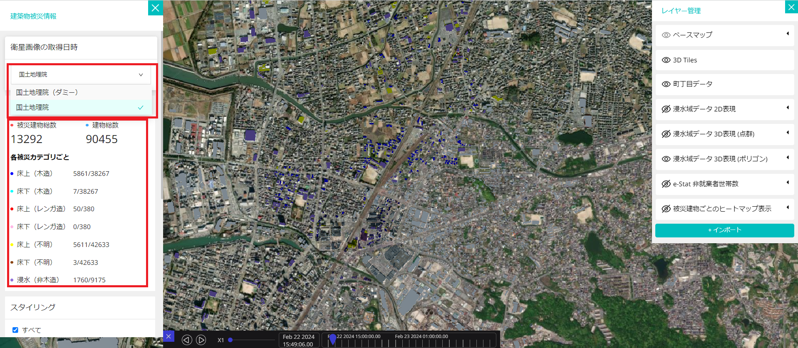
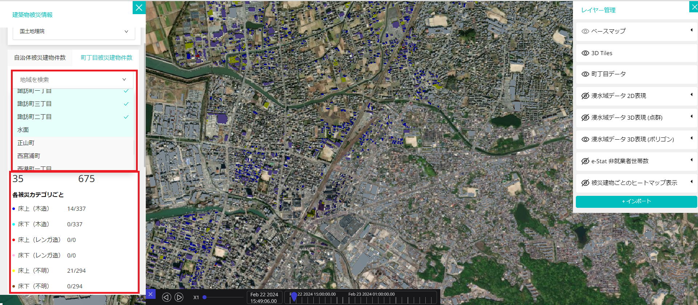
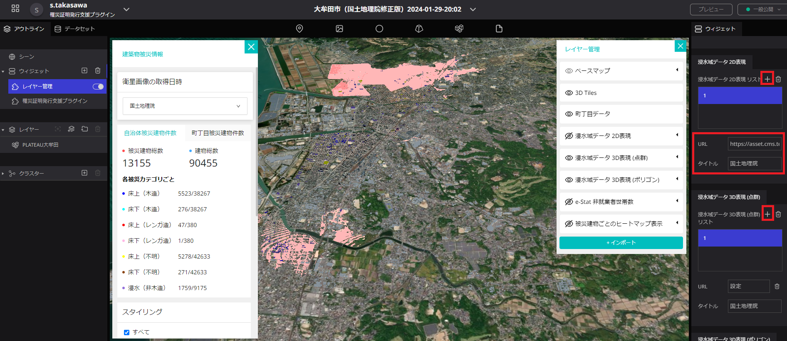

# インストール手順書

# 1 本書について

本書では、SAR 衛星解析による洪水被害の推定結果の可視化を行う Re:Earth プラグイン（以下「本システム」という）の利用環境構築手順について記載しています。本システムの構成や仕様の詳細については以下も参考にしてください。

[技術検証レポート](https://www.mlit.go.jp/XXX)

# 2 動作環境

本システムの動作環境は以下のとおりです。

| 項目               | 最小動作環境                                                                                                                         | 推奨動作環境 |
| ------------------ | ------------------------------------------------------------------------------------------------------------------------------------ | ------------ |
| OS                 | Web ブラウザが動作する全てのデスクトップ OS（Windows, macOS, Linux, Chrome OS）やモバイル OS（iOS、Andorid）に対応                   | 同左         |
| 対応ブラウザ       | Chrome 58\_   Firefox 57+   Safari 11+（macOS のみ）   Microsoft Edge XX 以降   iOS(11+) Safari   Android(10+) Chrome | 同左         |
| ディスプレイ解像度 | 1000×700 以上                                                                                                                        | 同左         |
| ネットワーク       | 必要                                                                                                                                 | 同左         |

# 3 インストール手順

### プラグインのインストール

[こちら](https://github.com/Project-PLATEAU/reearth-plugin-flooddamage-widget/releases/)
から本システム（3d-tiles-inspector.zip,building-style.zip,layer-management.zip）をローカル環境にダウンロードします。

ダウンロード後、<a href="https://reearth.io/">Re:Earth</a>を立ち上げ、プラグインを Re:Earth Editor からインストールします。画面上部にある下矢印のボタンをクリックし、"Pulugins"を選択した後、"Zip file from PC"からダウンロードした 3 つのプラグインをアップロードします。

各種プラグインをインストールした後、Re:Earth Editor に戻り Widgets の＋（プラス）ボタンをクリックし、"罹災証明発行支援プラグイン"、"レイヤー管理"を選択します。

"罹災証明発行支援プラグイン"、"レイヤー管理"を選択すると下記の画像のようになります。

### 3D 都市モデルレイヤーの追加

- 画面上部の 3D 都市モデルのアイコンを地図上へドラッグ＆ドロップすることで 3D 都市モデルのレイヤーを追加します。

### シーンの編集

地形を ON、種類を「Cesium Ion」にし、Cesium Ion アセット ID と Cesium Ion アクセストークンを入力します。
[PLATEAU-Terrain の配信チュートリアル](https://github.com/Project-PLATEAU/plateau-streaming-tutorial/blob/main/terrain/plateau-terrain-streaming.md)から、アクセストークン及びアセット ID を取得することができます。次に先進的機能の使用を ON にします。

### 3D 都市モデル・インフォボックスの設定

- レイヤーに 3D タイルが追加されているため、クリックすることでレイヤーの設定が行えます。
- タイルセット URL から、3D 都市モデルの tileset.json の URL を入力します。（参考: [G 空間情報センター 3D 都市モデル（Project PLATEAU）ポータルサイト](https://www.geospatial.jp/ckan/dataset/plateau)）
- インフォボックスの設定を開き、インフォボックスの作成を行います。
- インフォボックスに 3D-Tile Injector を追加します。
- インフォボックスの背景色を「#d9d9d9ff」に設定します。

### 「罹災証明書発行支援プラグイン」の設定

**衛星画像の解析結果のデータ入力**

- データリストを追加することで、ダッシュボード部の「衛星画像の取得日時」で選択できる項目を追加します。
- データリストに衛星画像の解析結果のタイトルと建物被災データの入力を行います。

**被災建物リスト（CSV 形式）と 3D 都市モデルの連動**

- 行政区分図を追加します。
- 行政区分図の名称を設定します。
- 3D 都市モデルのタイトルを入力します。

- 衛星画像の取得日時で表示する衛星画像を選択できます。
- 被災建物総数と建物総数、被災カテゴリ毎の被災建物件数と建物件数が表示されます。

- 町丁目被災建物件数を押し、町丁目を選択する。町丁目は検索することもできます。
- 選択地域の被災建物総数と建物総数、被災カテゴリ毎の被災建物件数と建物件数が表示されます。

- 被災カテゴリ毎の色分け設定を編集することができます。
- ダウンロードボタンを押下することで、選択地域別集計データ、建物毎の集計データと、被災カテゴリ毎の色分け設定用のスタイルを保存できます。

### 「レイヤー管理プラグイン」の設定

**ベースマップの設定とウィジェットのリソース設定**

- ベースマップの選択を行えるように、タイルリストを追加します。
- ベースマップとサムネイル画像とタイトルを設定することで、プラグイン上でベースマップの切り替えが行えるようになります。
- 3D 都市モデルのタイトルを入力します。
- 「罹災証明書発行支援プラグイン」ウィジェットで設定した行政区分図の名称を入力します。
- e-Stat 非就業者世帯数のデータを設定します。

**表示データの設定**

- データリストを追加することで、ダッシュボード部の「衛星画像の取得日時」と連動して表示するデータが切り替えられます。
- 衛星画像の解析結果のタイトルとデータを入力する。入力するデータは以下の通りです。

  | 名称                       | 内容                                                           |
  | -------------------------- | -------------------------------------------------------------- |
  | 浸水域 2D 表現             | 衛星解析によって得られる浸水域の XYZ タイルデータ              |
  | 浸水域 3D 表現（点群）     | 衛星解析によって得られる浸水域の点群の 3D タイルデータ         |
  | 浸水域 3D 表現（ポリゴン） | 衛星解析によって得られる浸水域を 3D のポリゴンデータ化したもの |
  | 床上(木造)データ           | 衛星解析によって得られる床上浸水（木造）のヒートマップ         |
  | 床下(木造)データ           | 衛星解析によって得られる床下浸水（木造）のヒートマップ         |
  | 木造家屋総数データ         | 衛星解析によって得られる木造家屋総数のヒートマップ             |

・データの表示／非表示が選択できます。  
・表示するデータをインポートすることができます。  

### プロダクトの公開

Unpublidhed > Publish > Publish（青枠）の順にクリックすることでコンテンツを公開することができます。作成したものは URL で共有可能となります。

# 4 準備物一覧

アプリケーションを利用するために以下のデータを入手します。

|     | データ種別                                                                                                                                                              | 機能                     | 用途                 | 入力方法                                    |
| --- | ----------------------------------------------------------------------------------------------------------------------------------------------------------------------- | ------------------------ | -------------------- | ------------------------------------------- |
| ①   | 3D 都市モデル(CityGML)G 空間情報センターから取得します。 https://front.geospatial.jp/                                                                                | 全般                     | 全般                 | 3DTiles の tileset.json の URL を指定       |
| ②   | 建物被災状況　 SAR 衛星解析による洪水被害の推定システムから取得します。 https://github.com/Project-PLATEAU/SAR-image-based-flood-damage-detector                     | 全般                     | 全般                 | CSV ファイルの URL を指定                   |
| ③   | 3D 浸水域・浸水深の画像タイル　 SAR 衛星解析による洪水被害の推定システムから取得します。 https://github.com/Project-PLATEAU/SAR-image-based-flood-damage-detector    | レイヤー管理ウィジェット | データの表示／非表示 | 画像タイルの URL を指定                     |
| ④   | 浸水域・浸水深の 3D タイルデータ　 SAR 衛星解析による洪水被害の推定システムから取得します。 https://github.com/Project-PLATEAU/SAR-image-based-flood-damage-detector | レイヤー管理ウィジェット | データの表示／非表示 | 3DTiles の tileset.json の URL を指定       |
| ⑤   | 被災建物のヒートマップ画像タイル　 SAR 衛星解析による洪水被害の推定システムから取得します。 https://github.com/Project-PLATEAU/SAR-image-based-flood-damage-detector | レイヤー管理ウィジェット | データの表示／非表示 | 画像タイルの URL を指定                     |
| ⑥   | 町丁目データ e-Stat から取得します。 https://www.e-stat.go.jp/help/view-on/map/boundary_data                                                                         | 全般                     | 全般                 | Re:Earth のアセットに登録してファイルを指定 |
| ⑦   | 非就業者世帯数の分布を e-Stat から取得します。 https://www.e-stat.go.jp/                                                                                             | レイヤー管理ウィジェット | データの表示／非表示 | 画像タイルの URL を指定                     |

本システムでは、3D 都市モデルの建築物モデルの形状（LOD1）と属性を活用します。

| 地物        | 地物型        | 属性区分 | 属性名                    | 内容                 |
| ----------- | ------------- | -------- | ------------------------- | -------------------- |
| 建築物 LOD1 | bldg:Building | 主題属性 | bldg:measuredHeight       | 計測高さ             |
|             |               |          | uro:buildingID            | 建物 ID              |
|             |               |          | uro:buildingStructureType | 構造種別             |
|             |               | 空間属性 | bldg:lod1Solid            | 建築物の LOD1 の立体 |
